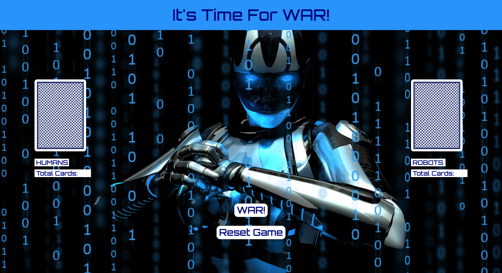
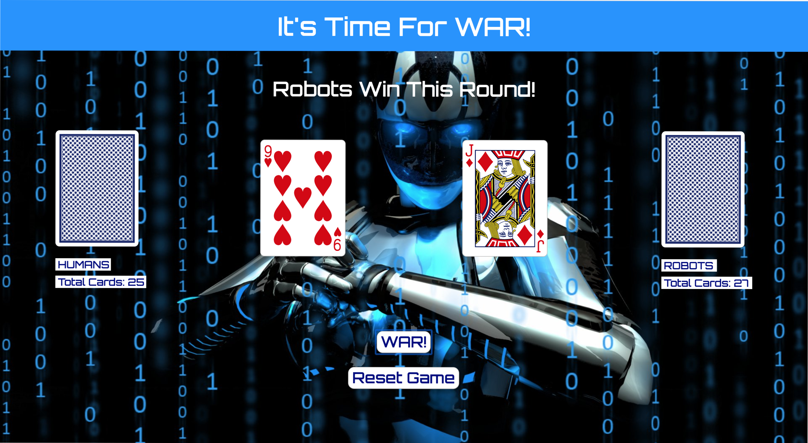
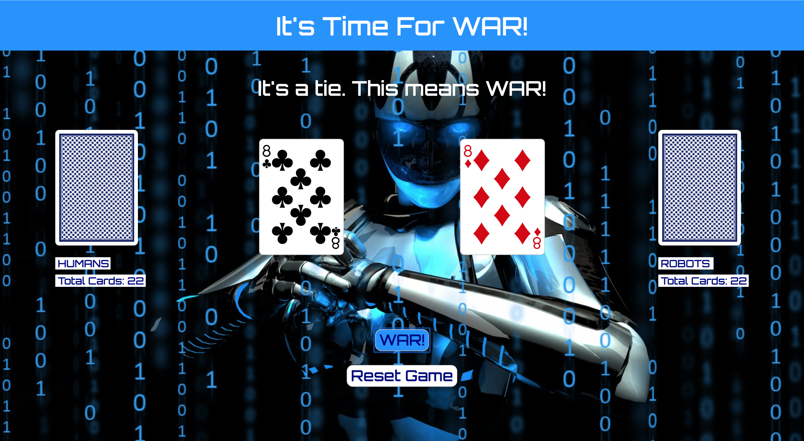

# A Game Of War

While War is a very commonly played card game, the origin of the game is unknown. Although rumoured to be invented by King Arthur, it can be traced back centuries with no difinitive answer. However, in my own life, it can be traced back to my childhood. I have fond memories of playing War with both family and friends!

# Screenshots

## When you first load the page

## When you play the game

## When you enter a tie

# Technologies Used

This game was created using HTML, CSS and JavaScript.

# Getting Started

The game of War is a simple one. A deck of 52 playing cards is dealt one by one to two players, giving each player 26 cards. Each player flips up a card at the same time, and the player with the higher card value takes both cards and puts them at the bottom of their stack.

 If the cards flipped have the same value, IT'S WAR TIME. Each player will then place 3 cards face down, and flip a fourth card face up. The player with the higher card value takes all 8 cards and puts them at the bottom of their stack. If a tie happens again, you repeat the process until one player has a higher value card.

 The first player to gather all 52 cards is the winner. Click below to play!

 **Insert Link Here**

# Next Steps

First, I would add code to make it so the user can visually see when a tie happens. Currently my JavaScript deals with a tie in the proper manner, but does not display the 3 cards played on the screen during the tie, it just updates the score with those cards.

Secondly, I would like to add some code that allows a player to enter a tie with less than 4 cards, and be able to play through the tie with whatever amount of cards they have left. As it stands now, the other player is automatically declared the winner if their opponent enters a tie with less than 4 cards.
Secondly

Lastly, I would like add some responsive design using media queries so that my game can be played on other devices.

